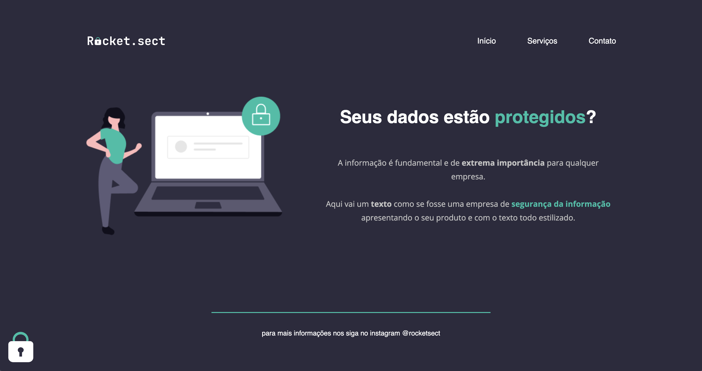

# 🔐 **Recriação de Layout - "Proteção de Dados"**

## 🪪 *Layout Recreation - "Data Protection"*

# 
## 🚀 *Technologies*

- **[HTML](../index.html)**
- [CSS](../style.css)
- **[Figma](https://www.figma.com/file/EdKjPWjC8ZlbnH4XzTObv2/Explorer/duplicate?node-id=0%3A1)**
- [VScode](vscode.com/vscode)

#
## 📝 *Project* 

🇺🇸 Project made in Rocketseat's course "Explorer". The idea was to create the project in HTML and CSS based on the layout sent via Figma. February 2023.

🇧🇷 Projeto realizado no curso "Explorer" da Rocketseat. A ideia era criar o projeto em HTML e CSS com base no layout enviado via Figma. Fevereiro 2023. 

#

🌎 **[🇺🇸 Project on-line here!  
🌍 🇧🇷 Projeto on-line aqui!](../index.html)** 

#

                    Desenvolvido com 🧡 by BM 
                    Developed with 🧡 by BM